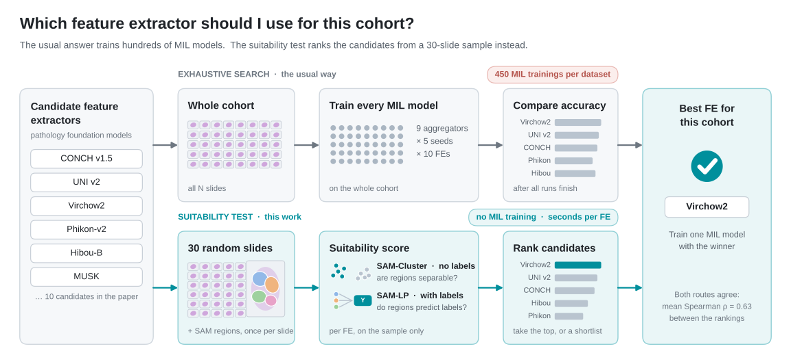
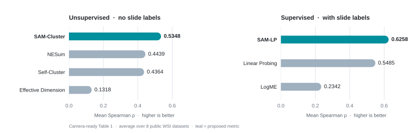
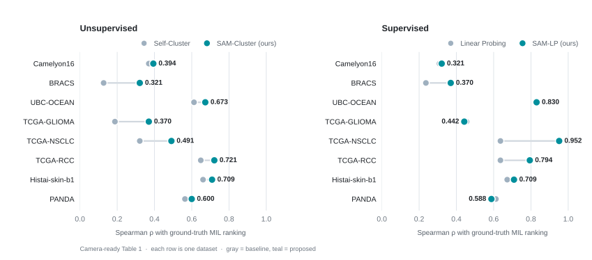
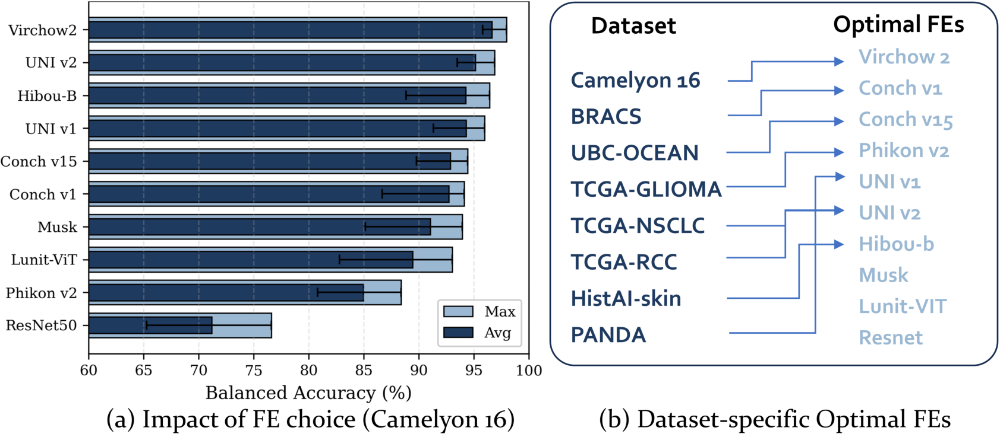
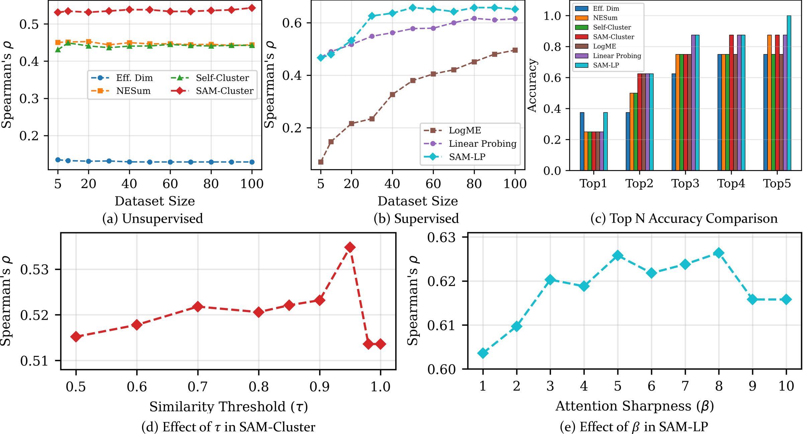
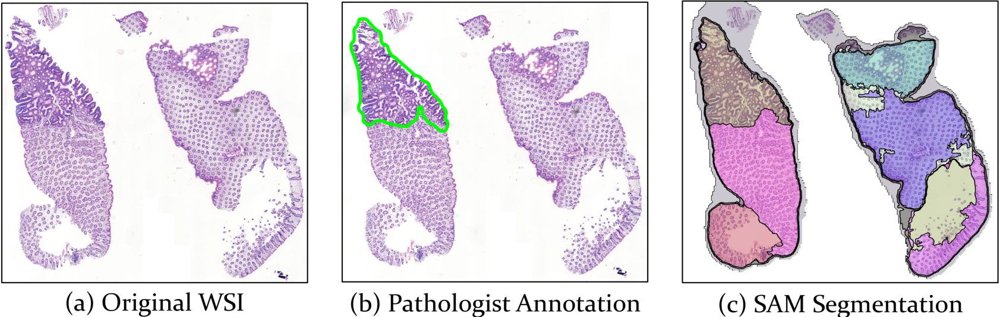
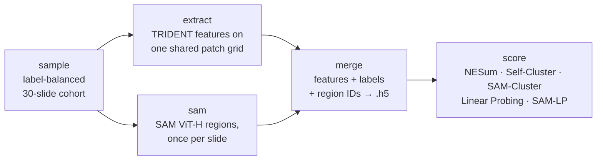

<div align="center">

# WSI-FE-Selection

**SAM-Cluster and SAM-LP: Structure-Aware Evaluation Metrics for<br>Selecting WSI Feature Extractors without MIL Training**

<sub>Medical Image Computing and Computer Assisted Intervention · <b>MICCAI 2026</b></sub>

<br>

[](docs/paper.pdf)
[](docs/paper.pdf)
[](#installation)
[](https://github.com/juhyeon-ai/WSI-FE-Selection/actions/workflows/tests.yml)
[](LICENSE)

<br>

**Juhyeon Kim** · **Paul Ssemakula** · **Chanjae Song** · **Mun Yong Yi**<sup>†</sup>

Korea Advanced Institute of Science and Technology (KAIST)<br>
<sub><sup>†</sup> Corresponding author</sub>

<br>

[**Paper**](docs/paper.pdf) · [**Results**](#results) · [**Method**](#method) · [**Quickstart**](#quickstart) · [**Documentation**](#documentation) · [**Citation**](#citation)

</div>

<br>

<picture>
  <source media="(prefers-color-scheme: dark)" srcset="assets/overview_dark.svg">
  
</picture>

<p align="center"><sub><b>Figure 1.</b> Same question, two routes. Exhaustive search trains every MIL model on the whole cohort. The suitability test scores each candidate on 30 random slides with SAM regions and ranks them, with no MIL training. The winner shown is an example.</sub></p>

<br>

Choosing a feature extractor (FE) is one of the most consequential decisions in a whole-slide image (WSI) pipeline. On Camelyon16, swapping an ImageNet ResNet50 for Virchow2 lifts balanced accuracy from 76.6% to 98.0%, and no single foundation model wins on every cohort. Finding the right one usually means training and comparing dozens of Multiple Instance Learning (MIL) models.

**WSI-FE-Selection ranks candidate pathology feature extractors *before* any MIL training.** It scores pre-extracted features from a small random subset of your slides, using the Segment Anything Model (SAM) as a zero-shot proxy for tissue structure, and returns a ranking that closely follows what fully trained MIL models would have told you.

<table>
<tr>
<td width="50%" valign="top">

**🧭 &nbsp;Structure-aware by design**<br>
SAM masks act as pseudo-structural labels, so the metrics reward intra-region cohesion and inter-region boundaries instead of treating patches as i.i.d. samples.

</td>
<td width="50%" valign="top">

**🏷️ &nbsp;With or without slide labels**<br>
SAM-Cluster is unsupervised and SAM-LP is supervised. Seven metrics are implemented; five complementary ones are reported by default.

</td>
</tr>
<tr>
<td width="50%" valign="top">

**📈 &nbsp;Closest agreement with MIL rankings**<br>
Mean Spearman ρ of 0.535 (SAM-Cluster) and 0.626 (SAM-LP) against ground truth from 10 FEs × 9 aggregators × 8 datasets. SAM-LP's top-5 shortlist contains the best FE on every dataset.

</td>
<td width="50%" valign="top">

**⚡ &nbsp;A fraction of the cost**<br>
Around 30 slides, no aggregator training, and SAM once per slide (under 1% of a single feature extraction). Cost scales with *n / N*; a candidate scores in seconds once features exist.

</td>
</tr>
</table>

## News

- 🎉 &nbsp;Our paper is accepted at **MICCAI 2026**.
- 🚀 &nbsp;**2026-09** &nbsp;Code, configurations, benchmark ground truth and the [camera-ready paper](docs/paper.pdf) are released.

## Results

### Rank correlation with fully trained MIL models

Every metric is evaluated by the **Spearman rank correlation (ρ)** between its FE ranking and the ground-truth ranking obtained from exhaustive MIL training. Higher is better; ρ measures ranking quality, not classification accuracy.

<picture>
  <source media="(prefers-color-scheme: dark)" srcset="assets/benchmark_dark.svg">
  
</picture>

<picture>
  <source media="(prefers-color-scheme: dark)" srcset="assets/per_dataset_dark.svg">
  
</picture>

- **Unsupervised.** SAM-Cluster reaches a mean ρ of **0.5348**, above Self-Cluster (0.4364) and NESum (0.4439), and it is higher than both on **all 8 datasets** (Wilcoxon signed-rank *p* = 0.0078). Gains are largest on structurally complex cohorts such as Camelyon16, BRACS and Histai-skin-b1.
- **Supervised.** SAM-LP reaches a mean ρ of **0.6258**, above Linear Probing (0.5485). It matches or exceeds Linear Probing on 6 of 8 datasets, with the largest gain on TCGA-NSCLC (0.6364 → **0.9515**); Linear Probing edges ahead only on the two structurally simplest cohorts, PANDA and TCGA-GLIOMA.
- **Shortlisting.** Within the top-5 candidates, SAM-LP includes the optimal FE on **8 / 8 datasets**. SAM-Cluster keeps a 62.5% hit rate even in a narrow top-2 shortlist.

<details open>
<summary><b>Table 1 · Spearman ρ between each metric and ground-truth MIL performance</b></summary>
<br>

| Dataset | Eff. Dim. | NESum | Self-Cluster | **SAM-Cluster** (ours) | LogME | Linear Probing | **SAM-LP** (ours) |
| :-- | --: | --: | --: | --: | --: | --: | --: |
| Camelyon16 | 0.1030 | 0.3576 | 0.3697 | **0.3939** | -0.1903 | 0.3091 | 0.3212 |
| BRACS | -0.3939 | 0.0909 | 0.1273 | 0.3212 | -0.2024 | 0.2364 | **0.3697** |
| UBC-OCEAN | 0.2242 | 0.6485 | 0.6121 | 0.6727 | 0.1806 | **0.8303** | **0.8303** |
| TCGA-GLIOMA | 0.3818 | 0.3455 | 0.1879 | 0.3697 | **0.5103** | 0.4545 | 0.4424 |
| TCGA-NSCLC | -0.1636 | 0.4061 | 0.3212 | 0.4909 | 0.1976 | 0.6364 | **0.9515** |
| TCGA-RCC | 0.0303 | 0.5273 | 0.6485 | 0.7212 | 0.4836 | 0.6364 | **0.7939** |
| Histai-skin-b1 | 0.3697 | 0.5879 | 0.6606 | **0.7091** | 0.1515 | 0.6727 | **0.7091** |
| PANDA | 0.5030 | 0.5879 | 0.5636 | 0.6000 | **0.7430** | 0.6121 | 0.5879 |
| **Average** | 0.1318 | 0.4439 | 0.4364 | 0.5348 | 0.2342 | 0.5485 | **0.6258** |

<sub>Bold marks the best metric in each row. Each entry averages five random 30-slide subsets (PANDA: 600 slides, because its slides are far smaller). Standard deviations, aggregator-stratified results and resource measurements are in the <a href="docs/paper_details.md">method and results notes</a>; the raw table is in <a href="docs/results/table1.csv">CSV</a>.</sub>

</details>

### Ground truth

The reference rankings come from exhaustively training every combination below and averaging downstream performance over five seeds, which is 450 full MIL runs per dataset.

<p align="center">
  
</p>

<p align="center"><sub><b>Figure 2.</b> Why selection matters. On Camelyon16 the FE alone moves balanced accuracy by more than 20 points, and the best FE changes from dataset to dataset.</sub></p>

| | |
| :-- | :-- |
| **Datasets (8)** | Subtyping, scored by balanced accuracy: Camelyon16 · BRACS · UBC-OCEAN · TCGA-GLIOMA · TCGA-NSCLC · TCGA-RCC · Histai-skin-b1 &nbsp;·&nbsp; Grading, scored by quadratic weighted kappa: PANDA |
| **Feature extractors (10)** | CONCH v1 · CONCH v1.5 · Hibou-B · Lunit-ViT · MUSK · Phikon-v2 · ResNet50 · UNI v1 · UNI v2 · Virchow2 |
| **MIL aggregators (9)** | Mean pooling · AB-MIL · DS-MIL · CLAM · TransMIL · DTFD-MIL · WiKG · RRT-MIL · ILRA |

The averaged ground truth is representative rather than aggregator-specific: it correlates with individual aggregator rankings at a mean ρ of 0.82 and with the best aggregator per dataset at ρ = 0.93. Training code and splits are in [`Benchmark-MIL/`](Benchmark-MIL/); per-dataset results are in [`Ground Truth/`](Ground%20Truth/).

### Robustness

- **Sample size.** SAM-Cluster outperforms every unsupervised baseline from as few as 5 slides. SAM-LP approaches its maximum at 30 slides, whereas Linear Probing needs at least 80, and SAM-LP's peak (ρ = 0.658) is higher than Linear Probing's (ρ = 0.617).
- **Hyperparameters.** Both metrics are stable across broad ranges of the similarity threshold τ and the attention sharpness β. All experiments use τ = 0.95 and β = 5 with no dataset-specific tuning.

<details>
<summary>Sample-size, top-<i>k</i> and sensitivity curves (paper Fig. 4)</summary>
<br>
<p align="center"></p>
</details>

## Method

<p align="center">
  
</p>

<p align="center"><sub><b>Figure 3.</b> SAM has no medical vocabulary, yet its zero-shot masks trace the same morphological boundaries a pathologist annotates. We use these masks as pseudo-structural regions.</sub></p>

Existing transferability metrics were designed for single images. Applied to WSIs, unsupervised ones treat thousands of patches as i.i.d. samples and ignore tissue organization, while supervised ones mean-pool a slide into one vector and let abundant background tissue dilute the diagnostic signal of small regions. Both metrics below start from the same ingredients: patch embeddings $z_{i,j}$ from a candidate FE $\phi$, and SAM region masks $M_{i,k}$ computed once per slide.

### SAM-Cluster · unsupervised

A good FE keeps embeddings consistent inside one tissue structure and distinct across structures. With $L_2$-normalized embeddings, SAM-Cluster compares intra-region cohesion with a *relaxed* inter-region separation in which mask pairs whose centroids are more similar than a threshold $\tau$ are excluded, which absorbs SAM's tendency to over-segment:

$$
S_{\text{intra}} = \mathbb{E}_{k}\Big[\mathbb{E}_{z_i, z_j \in Z^{(k)}}\big[(z_i^{\top} z_j)^2\big]\Big], \qquad
S_{\text{inter}} = \mathbb{E}_{(k,l) \notin \mathcal{E}}\Big[\mathbb{E}_{z_i \in Z^{(k)}, z_j \in Z^{(l)}}\big[(z_i^{\top} z_j)^2\big]\Big]
$$

$$
S_{\text{SAM-Cluster}}(\phi) = 1 - \frac{S_{\text{inter}}}{S_{\text{intra}}}
$$

### SAM-LP · supervised

Instead of mean pooling, each slide is rebuilt from its region prototypes $c_{i,k}$ with weights $\alpha_{i,k}$ that start proportional to mask size. One EM update refines them: the M-step fits a linear classifier $\theta$ on the aggregated embeddings, and the E-step sharpens the weights toward prototypes that predict the label, with $\beta$ controlling the sharpness.

$$
\tilde{z}_i = \sum_{k} \alpha_{i,k} c_{i,k}, \qquad
\alpha_{i,k}^{(t+1)} \propto \alpha_{i,k}^{(0)} \exp\big(\beta \log P(Y_i \mid c_{i,k};\theta^{(t)})\big), \qquad
S_{\text{SAM-LP}}(\phi) = \frac{1}{N}\sum_{i=1}^{N} \log P\big(Y_i \mid \tilde{z}_i^{\ast};\theta^{\ast}\big)
$$

### Why it is cheap

Exhaustive selection costs $N \times |\Phi| \times (K \cdot C_{\text{FE}} + M \cdot C_{\text{agg}})$ over all $N$ slides. This framework touches $n \ll N$ slides, trains no aggregator, and runs SAM once per slide regardless of how many FEs are compared, so the cost ratio is roughly $n / N$.

| Component (Camelyon16, RTX A6000) | Cost |
| :-- | :-- |
| Feature extraction, per WSI and per FE | ≈ 343 TFLOPs |
| SAM ViT-H on a 2048 px thumbnail, once per WSI | 2.98 TFLOPs (< 1% of one extraction) |
| SAM-Cluster / SAM-LP scoring | ≈ 3.7 MFLOPs · about 6–7 s per FE for 30 slides |

## Installation

Use **Python 3.10 or 3.11**. Scoring existing features runs on CPU with a handful of packages; the full WSI workflow targets Linux and benefits from a CUDA GPU.

```bash
git clone https://github.com/juhyeon-ai/WSI-FE-Selection.git
cd WSI-FE-Selection
python3 -m venv .venv && source .venv/bin/activate
python -m pip install --upgrade pip
python -m pip install -r requirements.txt          # scoring only (NumPy, h5py, SciPy, scikit-learn, Numba)
```

For the full WSI workflow, install a compatible **PyTorch + torchvision** pair from the [PyTorch installer](https://pytorch.org/get-started/locally/), then:

```bash
bash scripts/setup_dependencies.sh                 # pinned TRIDENT + SAM 1 into third_party/
```

Before processing real slides, download the SAM ViT-H checkpoint and obtain access to any gated encoders, as described in the [workflow guide](docs/quickstart.md#1-clone-and-install).

## Quickstart

| You have | Start here |
| :-- | :-- |
| Nothing yet, want to see the interface | [CPU demo](#cpu-demo) · synthetic features, no downloads |
| Patch features as `.h5` files | [Score feature files](#score-feature-files) · one directory per candidate FE |
| Raw WSIs and slide labels | [Start from WSIs](#start-from-wsis) · sample, extract, segment, score |

### CPU demo

```bash
python scripts/make_demo_features.py
python -m suitability_score --feature-root runs/demo/features --output-dir runs/demo/scores
```

This writes synthetic features for two artificial encoders and exports the five default metrics. Open `runs/demo/scores/ranking.csv`: every metric gets a rank column followed by `mean_rank`, and **lower ranks are better**. The demo illustrates the input and output format only; its scores say nothing about real models.

### Score feature files

Arrange files as `features/<encoder>/<slide_id>.h5` with the same slides under every encoder, then:

```bash
python -m suitability_score --feature-root /data/features --output-dir runs/my_scores
```

Each file holds a `features` array. Supervised metrics also need `label`; SAM metrics need patch-aligned `sam_region` IDs. The [metric reference](suitability_score/README.md) documents the HDF5 contract and every option.

### Start from WSIs

**1. Describe your cohort** in a manifest like [`examples/slides.csv`](examples/slides.csv):

```csv
slide_id,wsi_path,label,split,patient_id
slide_001,/data/slides/slide_001.svs,normal,train,patient_001
slide_002,/data/slides/slide_002.svs,tumor,train,patient_002
```

**2. Configure the run** in [`configs/quickstart.json`](configs/quickstart.json): set `manifest`, `work_dir`, the candidate `encoders` and the total `n_slides`. The default samples 30 training slides with label balance; every class must be present, and paths are relative to the config file.

**3. Preview, then run.**

```bash
python -m preprocessing --config configs/quickstart.json --dry-run
python -m preprocessing --config configs/quickstart.json
```



Stages can be run individually with `--stages`, and re-running the same config reuses the saved sample, TRIDENT outputs and SAM maps. Only `train` rows are sampled; a `patient_id` column enables patient-overlap checks between splits. The [workflow guide](docs/quickstart.md) covers slide formats, sampling options, resuming and troubleshooting.

### Read the results

```text
runs/quickstart/
├── sample.csv                 # exact sampled cohort, shared by every FE
├── label_mapping.json
├── config.resolved.json
├── sam/                       # region maps and *_overlay.jpg for visual inspection
├── features/<encoder>/*.h5    # features, labels and patch-aligned SAM region IDs
└── scores/
    ├── scores.csv             # raw score per metric and FE (higher is better)
    ├── ranking.csv            # per-metric ranks and mean rank (lower is better)
    ├── coverage.csv           # SAM coverage and region counts per slide
    └── metadata.json          # effective settings, seeds and software versions
```

Read the five default metrics together: favor candidates that rank well across several of them, inspect disagreements, and validate a short list on your downstream task. The mean rank is an equal-weight screening heuristic, not a metric validated in the paper. Linear Probing and SAM-LP report in-sample log-likelihood rather than held-out accuracy, and SAM-based scores should be interpreted only after checking `coverage.csv` and the overlays.

### Configure the metrics

All defaults live in [`configs/suitability.json`](configs/suitability.json) and are shared by the Python functions, the scoring CLI and the WSI workflow: 128-dimensional projection, SAM-Cluster with τ = 0.95, and SAM-LP with one EM step, soft selection and β = 5. To change anything, copy the file and pass it back in:

```bash
cp configs/suitability.json configs/my_suitability.json
python -m suitability_score --feature-root /data/features --output-dir runs/custom \
  --config configs/my_suitability.json
```

The effective configuration is saved next to the scores. See the [configuration reference](suitability_score/README.md#one-configuration-for-every-entry-point) for every parameter and the Python API.

## Documentation

| Resource | What it covers |
| :-- | :-- |
| [Workflow guide](docs/quickstart.md) | Installation, checkpoints, manifests, staged execution, troubleshooting |
| [Metric reference](suitability_score/README.md) | All seven metrics, HDF5 schema, configuration precedence, Python usage |
| [Method and results](docs/paper_details.md) | Full derivations, Table 1 with standard deviations, resource tables |
| [Implementation notes](docs/implementation_notes.md) | Pinned dependency revisions, new-cohort defaults versus the paper, validation log |
| [Third-party terms](docs/third_party.md) | Licenses for TRIDENT, SAM, encoders and the benchmark code |

```text
WSI-FE-Selection/
├── suitability_score/     # the seven metrics and the scoring CLI  (python -m suitability_score)
├── preprocessing/         # sample → extract → sam → merge → score  (python -m preprocessing)
├── configs/               # suitability.json (metric defaults) · quickstart.json (workflow)
├── Benchmark-MIL/         # MIL training code and data splits behind the ground truth
├── Ground Truth/          # downstream results per dataset used as reference rankings
├── scripts/               # setup_dependencies.sh · make_demo_features.py · plot_benchmark.py
├── tests/                 # synthetic CPU tests run in CI
├── docs/                  # paper.pdf, guides, result tables
└── assets/                # figures used in this README
```

## Citation

If this work helps your research, please cite:

```bibtex
@inproceedings{kim2026samcluster,
  title     = {{SAM-Cluster} and {SAM-LP}: Structure-Aware Evaluation Metrics for
               Selecting WSI Feature Extractors without MIL Training},
  author    = {Kim, Juhyeon and Ssemakula, Paul and Song, Chanjae and Yi, Mun Yong},
  booktitle = {Medical Image Computing and Computer Assisted Intervention -- MICCAI 2026},
  year      = {2026}
}
```

A machine-readable citation is in [`CITATION.cff`](CITATION.cff). Volume, pages and DOI will be added once the proceedings are published.

## License

Original WSI-FE-Selection code is released under the **[Apache 2.0](LICENSE)** license. Third-party software and weights keep their own terms: the pinned TRIDENT revision restricts commercial use, and several encoders are gated. The scoring CLI does not import TRIDENT, SAM or PyTorch, so it can be used with features produced by any appropriately licensed pipeline. Details are in the [third-party notes](docs/third_party.md).

## Acknowledgements

This work was supported by the National Research Foundation of Korea (NRF) grant funded by the Korean government (MSIT), grant number RS-2022-NR068758, and by the Seegene Medical Foundation, Republic of Korea. The preprocessing workflow builds on [TRIDENT](https://github.com/mahmoodlab/TRIDENT) and [Segment Anything](https://github.com/facebookresearch/segment-anything); please cite them, and the feature extractors you compare, alongside this paper.

## Contact

Questions and reproducibility reports are welcome through [GitHub issues](https://github.com/juhyeon-ai/WSI-FE-Selection/issues).

**Juhyeon Kim** · wedsed123@kaist.ac.kr &nbsp;·&nbsp; **Mun Yong Yi** (corresponding) · munyi@kaist.ac.kr
